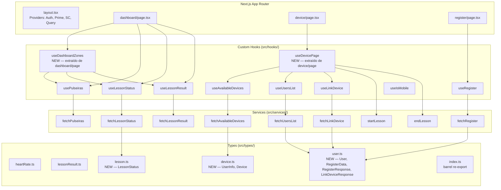

# Design Document — nextjs-refactoring

## Overview

Este documento descreve o design técnico para a refatoração do micro-frontend `dallas-ant-mfe`, um projeto Next.js 16 (App Router) de monitoramento de atletas em tempo real. A refatoração é **não-destrutiva**: nenhuma funcionalidade ou layout existente será alterado. O objetivo é melhorar a organização, padronizar convenções, introduzir testes unitários e eliminar inconsistências estruturais.

O projeto atual utiliza:
- **Next.js 16** com App Router e `basePath: /dallas-ant-mfe`
- **styled-components 6** com SSR via `StyledComponentsRegistry`
- **TanStack Query 5** para cache e sincronização de dados remotos
- **PrimeReact 10** como biblioteca de componentes UI
- **TypeScript 5** (atualmente com `strict: false`)
- **Jest 29** + **Testing Library 14** (configuração ainda ausente)

### Escopo da Refatoração

| Área | Estado Atual | Estado Alvo |
|---|---|---|
| Tipos TypeScript | Duplicados entre `src/types/` e `src/services/` | Centralizados em `src/types/`, barrel file limpo |
| Nomenclatura de estilos | `styles.tsx` genérico por rota | `{RouteName}.styles.tsx` por convenção |
| Pages | Lógica de negócio inline (ex: `zoneStats` no dashboard) | Pages finas ≤ 100 linhas, lógica em hooks |
| Custom Hooks | Sem testes | Cobertura ≥ 80% com Jest |
| Utilitários e Serviços | Sem testes | Testes unitários com mocks de `fetch` |
| Inline styles | Presentes em `device/page.tsx` e `dashboard/page.tsx` | Zero ocorrências, substituídos por styled-components |
| Configuração de testes | Ausente | `jest.config.ts` + `jest.setup.ts` configurados |
| Código morto | `src/types/index.ts` com tipos `Order`/`Payment` não utilizados | Removido, substituído por barrel file ativo |
| TypeScript strict | `"strict": false` | `"strict": true` com todos os erros corrigidos |

---

## Architecture

A arquitetura do projeto permanece inalterada. A refatoração opera dentro das camadas existentes, reorganizando responsabilidades sem introduzir novas dependências de runtime.



### Decisões Arquiteturais

**1. `layout.tsx` permanece `'use client'`**
O `QueryClient` é instanciado via `useRef` dentro do layout, o que exige a diretiva `'use client'`. Mover o `QueryClient` para um `QueryClientProvider` separado (Server Component wrapper) seria uma melhoria válida, mas está fora do escopo desta refatoração para evitar risco de regressão. O layout permanece como está, exceto pela remoção de quaisquer inline styles.

**2. Novo hook `useDashboardZones`**
O cálculo de `zoneStats` em `dashboard/page.tsx` (≈30 linhas de `useMemo`) será extraído para `src/hooks/useDashboardZones/index.ts`. Este hook recebe `isActive`, `resultData` e `pulseirasData` como parâmetros e retorna o array `ZoneStats[]`. Isso torna a lógica testável de forma isolada.

**3. Novo hook `useDevicePage`**
A página `device/page.tsx` gerencia 5 estados locais (`selectedDeviceId`, `selectedUserId`, `isStarting`, `isEnding`, `isModalOpen`) e 4 handlers. Todos serão encapsulados em `src/hooks/useDevicePage/index.ts`, que também orquestra `useAvailableDevices`, `useUsersList`, `useLinkDevice`, `useLessonStatus`, `startLesson` e `endLesson`.

**4. Tipos migrados de serviços para `src/types/`**
Os seguintes tipos definidos em arquivos de serviço serão movidos:
- `UserInfo`, `Device` de `fetchAvailableDevices/index.ts` → `src/types/device.ts`
- `LessonStatus` de `fetchLessonStatus/index.ts` → `src/types/lesson.ts`
- `User` de `fetchUsersList/index.ts` → `src/types/user.ts`
- `RegisterData`, `RegisterResponse` de `fetchRegister/index.ts` → `src/types/user.ts`
- `LinkDeviceResponse` de `fetchLinkDevice/index.ts` → `src/types/user.ts`

---

## Components and Interfaces

### Novos Custom Hooks

#### `useDashboardZones`

```typescript
// src/hooks/useDashboardZones/index.ts
import { useMemo } from 'react';
import { ZoneStats, HeartRateData } from '@/types/heartRate';
import { LessonResult } from '@/types/lessonResult';

interface UseDashboardZonesParams {
  isActive: boolean;
  resultData?: LessonResult;
  pulseirasData: HeartRateData[];
}

export const useDashboardZones = (params: UseDashboardZonesParams): ZoneStats[]
```

Encapsula o `useMemo` de cálculo de zonas cardíacas. Retorna `ZoneStats[]` calculado a partir dos dados de pulseiras (aula ativa) ou dos resultados da aula (aula encerrada).

#### `useDevicePage`

```typescript
// src/hooks/useDevicePage/index.ts
export interface UseDevicePageReturn {
  // Data
  devices: Device[];
  users: User[];
  lessonStatus: LessonStatus | undefined;
  selectedDevice: Device | undefined;
  // State
  selectedDeviceId: number | null;
  selectedUserId: string;
  isStarting: boolean;
  isEnding: boolean;
  isModalOpen: boolean;
  isLoading: boolean;
  isLinking: boolean;
  isError: boolean;
  isSuccess: boolean;
  error: Error | null;
  canLinkDevice: boolean;
  // Handlers
  handleSelectDevice: (deviceId: number) => void;
  handleLinkDevice: () => void;
  handleStartLesson: () => Promise<void>;
  handleEndLesson: () => Promise<void>;
  handleCloseModal: () => void;
  setSelectedUserId: (userId: string) => void;
}

export const useDevicePage = (): UseDevicePageReturn
```

### Componentes Extraídos

#### `LinkUserModal`

```typescript
// src/app/device/components/LinkUserModal.tsx
interface LinkUserModalProps {
  isOpen: boolean;
  selectedDevice: Device | undefined;
  users: User[];
  selectedUserId: string;
  isLinking: boolean;
  isSuccess: boolean;
  isError: boolean;
  error: Error | null;
  canLinkDevice: boolean;
  onClose: () => void;
  onUserSelect: (userId: string) => void;
  onLink: () => void;
}
```

Extrai o bloco do modal de vinculação de usuário de `device/page.tsx` (atualmente ≈60 linhas de JSX).

### Arquivos de Estilo Renomeados

| Arquivo Atual | Arquivo Alvo |
|---|---|
| `src/app/dashboard/styles.tsx` | `src/app/dashboard/Dashboard.styles.tsx` |
| `src/app/device/styles.tsx` | `src/app/device/Device.styles.tsx` |
| `src/app/register/styles.tsx` | `src/app/register/Register.styles.tsx` |

### Inline Styles a Eliminar

| Arquivo | Localização | Substituição |
|---|---|---|
| `device/page.tsx` | `<div style={{ gridColumn: '1 / -1', ... }}>` | `UserSectionDivider` styled-component em `Device.styles.tsx` |
| `device/page.tsx` | `<strong style={{ color: ..., fontSize: ... }}>` | `UserSectionLabel` styled-component em `Device.styles.tsx` |
| `device/page.tsx` | `<p style={{ fontSize: '12px', marginTop: '8px' }}>` | `EmptyStateHint` styled-component em `Device.styles.tsx` |
| `register/page.tsx` | `<ErrorMessage style={{ marginBottom: '20px' }}>` | Prop transiente `$marginBottom` em `ErrorMessage` |
| `register/page.tsx` | `<SuccessMessage style={{ marginBottom: '20px' }}>` | Prop transiente `$marginBottom` em `SuccessMessage` |
| `dashboard/page.tsx` | `<div style={{ color: '#fff', textAlign: 'center', paddingTop: '50px' }}>` | `LoadingMessage` styled-component em `Dashboard.styles.tsx` |
| `dashboard/components/Podium.tsx` | `<div style={{ color: '#fff', fontSize: '18px' }}>` | `EmptyResultMessage` styled-component em `Podium.styles.tsx` |

---

## Data Models

### Tipos Centralizados Após Refatoração

#### `src/types/device.ts` (novo)

```typescript
export interface UserInfo {
  id: string;
  name: string;
  gender?: string;
  weight?: number;
  height?: number;
  birthDate?: string;
  createdAt?: string;
  updatedAt?: string;
}

export interface Device {
  deviceId: number;
  heartRate?: number;
  beatTime?: number;
  beatCount?: number;
  manufacturerId?: number | null;
  serialNumber?: number | null;
  stickId?: number;
  receivedAt?: string;
  user?: UserInfo;
}
```

#### `src/types/lesson.ts` (novo)

```typescript
export interface LessonStatus {
  lessonId: string;
  status: 'ACTIVE' | 'INACTIVE' | 'ENDED';
  startedAt: string;
  duration: number;
}
```

#### `src/types/user.ts` (novo)

```typescript
export interface User {
  id: string;
  name: string;
  email: string;
  cpf?: string;
  phone?: string;
}

export interface RegisterData {
  name: string;
  height: number;
  weight: number;
  birthDate: string;
  gender: string;
}

export interface RegisterResponse {
  id: string;
  name: string;
  email: string;
  message?: string;
}

export interface LinkDeviceResponse {
  success: boolean;
  message?: string;
  deviceId?: number;
  userId?: string;
}
```

#### `src/types/index.ts` (substituído)

O arquivo atual contém tipos `Order`, `Payment`, `GroupedOrders` etc. que não são utilizados em nenhum componente do projeto. Será substituído por:

```typescript
// Barrel file — re-exporta apenas tipos de domínio ativos
export * from './heartRate';
export * from './lessonResult';
export * from './device';
export * from './lesson';
export * from './user';
```

### Configuração Jest

#### `jest.config.ts` (novo)

```typescript
import type { Config } from 'jest';
import nextJest from 'next/jest.js';

const createJestConfig = nextJest({ dir: './' });

const config: Config = {
  testEnvironment: 'jsdom',
  setupFilesAfterFramework: ['<rootDir>/jest.setup.ts'],
  moduleNameMapper: {
    '^@/(.*)$': '<rootDir>/src/$1',
  },
  collectCoverageFrom: [
    'src/hooks/**/*.{ts,tsx}',
    'src/utils/**/*.{ts,tsx}',
    'src/services/**/*.{ts,tsx}',
    '!**/*.test.{ts,tsx}',
    '!**/index.ts',
  ],
  coverageThreshold: {
    'src/hooks/': { lines: 80 },
  },
};

export default createJestConfig(config);
```

#### `jest.setup.ts` (novo)

```typescript
import '@testing-library/jest-dom';
```

#### `.babelrc` (novo, apenas para testes)

```json
{
  "presets": ["next/babel"],
  "plugins": [["babel-plugin-styled-components", { "ssr": true }]]
}
```

---

## Correctness Properties

*A property is a characteristic or behavior that should hold true across all valid executions of a system — essentially, a formal statement about what the system should do. Properties serve as the bridge between human-readable specifications and machine-verifiable correctness guarantees.*

A maioria dos requisitos desta refatoração são verificações estruturais e de configuração (SMOKE/INTEGRATION), não adequadas para property-based testing. Dois critérios de aceitação são genuinamente universais e se beneficiam de PBT:

### Property 1: Formatação BRL para qualquer número válido

*Para qualquer* número de ponto flutuante não-negativo, a função `toBRL` deve retornar uma string que corresponde ao formato de moeda brasileira (`R$` seguido de valor numérico com separador de milhar `.` e decimal `,`).

**Validates: Requirements 6.3**

### Property 2: Serviços lançam erro para qualquer status HTTP não-2xx

*Para qualquer* código de status HTTP no intervalo 400–599, quando um service recebe uma resposta com esse status, ele deve lançar uma instância de `Error` com uma mensagem descritiva (não vazia).

**Validates: Requirements 6.7**

---

## Error Handling

### Estratégia de Tratamento de Erros por Camada

**Services**
Todos os services já implementam tratamento de erro básico. Após a refatoração, o padrão será padronizado:
- Respostas não-2xx lançam `Error` com mensagem incluindo o status HTTP
- O `catch` externo re-lança com `error.message` preservado
- Nenhum service retorna `undefined` silenciosamente (ex: `fetchPulseiras` atualmente faz `console.warn` e retorna `undefined` — isso será corrigido para lançar o erro)

**Custom Hooks**
- Hooks de query expõem `isError` e `error` do TanStack Query para o componente consumidor
- Hooks de mutation expõem `isError` e `error` para feedback ao usuário
- O hook `useDevicePage` captura erros de `startLesson`/`endLesson` e os expõe via estado local

**Pages**
- Pages consomem `isError`/`error` dos hooks e renderizam mensagens de erro via styled-components (`ErrorMessage`)
- Nenhuma page faz `try/catch` diretamente — toda lógica de erro fica nos hooks

### TypeScript Strict Mode

A habilitação de `"strict": true` no `tsconfig.json` introduzirá erros principalmente em:
1. Parâmetros implicitamente `any` (ex: `error: any` nos catches dos services)
2. Possíveis valores `undefined` não tratados (ex: retorno de `fetchPulseiras`)
3. Propriedades opcionais acessadas sem verificação

Se o número de erros exceder 20, será criado `src/types/strict-migration.md` com plano incremental. A estimativa atual é de 8–15 erros, todos corrigíveis inline.

---

## Testing Strategy

### Abordagem Dual

A estratégia combina testes de exemplo (para comportamentos específicos) com testes de propriedade (para invariantes universais).

**Testes de Propriedade** (via `fast-check`):
- `toBRL`: para qualquer número ≥ 0, o retorno deve corresponder ao formato BRL
- Services: para qualquer status 4xx/5xx, o service deve lançar `Error`

**Testes de Exemplo** (via Jest + Testing Library):
- Hooks de query: loading, sucesso com dados válidos, erro
- Hooks de mutation: chamada com payload válido, tratamento de erro
- Componentes extraídos: snapshot para verificar equivalência visual

### Estrutura de Arquivos de Teste

```
src/
  hooks/
    usePulseiras/
      usePulseiras.test.ts
    useLessonStatus/
      useLessonStatus.test.ts
    useLessonResult/
      useLessonResult.test.ts
    useAvailableDevices/
      useAvailableDevices.test.ts
    useUsersList/
      useUsersList.test.ts
    useLinkDevice/
      useLinkDevice.test.ts
    useRegister/
      useRegister.test.ts
    useIsMobile/
      useIsMobile.test.ts
    useDashboardZones/
      useDashboardZones.test.ts
    useDevicePage/
      useDevicePage.test.ts
  utils/
    toBRL.test.ts
  services/
    fetchAvailableDevices/
      fetchAvailableDevices.test.ts
    fetchLessonStatus/
      fetchLessonStatus.test.ts
    fetchLessonResult/
      fetchLessonResult.test.ts
    fetchPulseiras/
      fetchPulseiras.test.ts
    fetchUsersList/
      fetchUsersList.test.ts
    fetchLinkDevice/
      fetchLinkDevice.test.ts
    fetchRegister/
      fetchRegister.test.ts
    startLesson/
      startLesson.test.ts
    endLesson/
      endLesson.test.ts
```

### Padrão de Teste para Hooks de Query

```typescript
// Exemplo: usePulseiras.test.ts
import { renderHook, waitFor } from '@testing-library/react';
import { QueryClient, QueryClientProvider } from '@tanstack/react-query';
import { usePulseiras } from './index';
import { fetchPulseiras } from '@/services/fetchPulseiras';

jest.mock('@/services/fetchPulseiras');

const createWrapper = () => {
  const queryClient = new QueryClient({ defaultOptions: { queries: { retry: false } } });
  return ({ children }) => (
    <QueryClientProvider client={queryClient}>{children}</QueryClientProvider>
  );
};

describe('usePulseiras', () => {
  it('retorna isLoading=true inicialmente', () => { /* ... */ });
  it('retorna dados no estado de sucesso', async () => { /* ... */ });
  it('retorna isError=true quando o service falha', async () => { /* ... */ });
});
```

### Padrão de Teste de Propriedade

```typescript
// Feature: nextjs-refactoring, Property 1: toBRL formats any non-negative number as BRL
import fc from 'fast-check';
import toBRL from './toBRL';

describe('toBRL', () => {
  it('Property 1: formata qualquer número não-negativo como BRL', () => {
    fc.assert(
      fc.property(fc.float({ min: 0, max: 1_000_000, noNaN: true }), (value) => {
        const result = toBRL(value);
        expect(result).toMatch(/^R\$\s[\d.]+,\d{2}$/);
      }),
      { numRuns: 100 }
    );
  });
});
```

```typescript
// Feature: nextjs-refactoring, Property 2: services throw Error for any non-2xx status
import fc from 'fast-check';
import { fetchLessonStatus } from './index';

describe('fetchLessonStatus', () => {
  it('Property 2: lança Error para qualquer status HTTP 4xx/5xx', async () => {
    await fc.assert(
      fc.asyncProperty(fc.integer({ min: 400, max: 599 }), async (status) => {
        jest.spyOn(global, 'fetch').mockResolvedValueOnce(
          new Response(JSON.stringify({ error: 'error' }), { status })
        );
        await expect(fetchLessonStatus()).rejects.toThrow(Error);
      }),
      { numRuns: 100 }
    );
  });
});
```

### Biblioteca de PBT

**`fast-check`** — escolhida por ser a biblioteca de property-based testing mais madura para TypeScript/JavaScript, com suporte nativo a geradores assíncronos e integração direta com Jest.

Instalação: `yarn add --dev fast-check`

### Configuração de Cobertura

- Mínimo de **100 iterações** por teste de propriedade (`numRuns: 100`)
- Cobertura de linha ≥ **80%** para `src/hooks/`
- Tag de rastreabilidade em cada teste de propriedade: `// Feature: nextjs-refactoring, Property N: <texto>`

### Ordem de Implementação Recomendada

Para garantir que `next build` passe após cada etapa:

1. **Req 8** — Configurar Jest (`jest.config.ts`, `jest.setup.ts`, `.babelrc`)
2. **Req 1** — Centralizar tipos em `src/types/` (sem quebrar imports)
3. **Req 9** — Limpar código morto (`src/types/index.ts`, CSS não utilizados, strict mode)
4. **Req 2** — Renomear arquivos de estilo e atualizar imports
5. **Req 7** — Eliminar inline styles
6. **Req 4** — Criar `useDevicePage` e `useDashboardZones`
7. **Req 3** — Refatorar pages para usar novos hooks e extrair `LinkUserModal`
8. **Req 5** — Escrever testes para todos os custom hooks
9. **Req 6** — Escrever testes para utilitários e services
10. **Req 10** — Verificação final: `next build` + `yarn test --ci`
